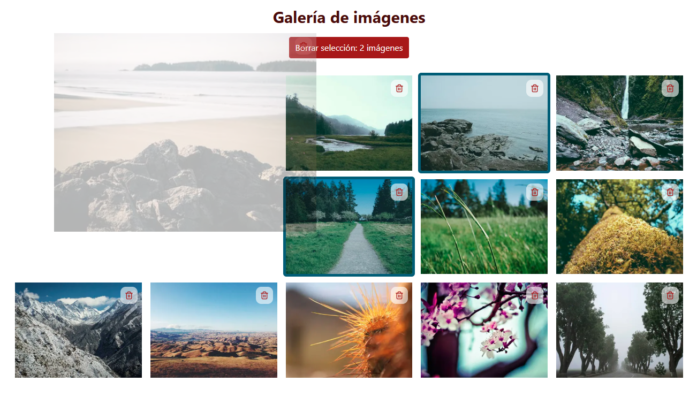
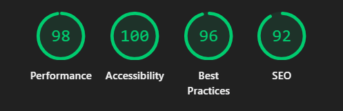
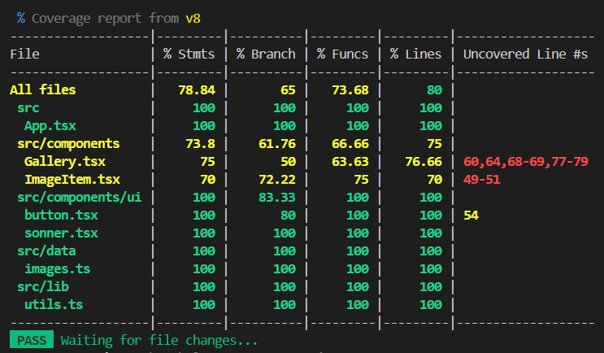

# Image Gallery

An interactive image gallery built with React and TypeScript as a learning exercise to explore component architecture, state management, drag and drop, and professional testing practices.

## Features

- Responsive image grid with a featured first image (larger display)
- Individual image deletion with confirmation dialog
- Multiple image selection with batch deletion
- Drag and drop reordering with visual feedback
- Accessible UI — keyboard navigation, ARIA attributes, screen reader support
- Toast notifications for user feedback

## Screenshots



## Tech Stack

- [React 19](https://react.dev/) — UI library
- [TypeScript](https://www.typescriptlang.org/) — type safety
- [Vite](https://vitejs.dev/) — build tool
- [Tailwind CSS v4](https://tailwindcss.com/) — utility-first styling
- [shadcn/ui](https://ui.shadcn.com/) — accessible component primitives
- [dnd-kit latest](https://dndkit.com/) — drag and drop
- [Sonner](https://sonner.emilkowal.ski/) — toast notifications
- [Vitest](https://vitest.dev/) + [React Testing Library](https://testing-library.com/react) — testing

## Project Structure

```
image-gallery/
├── public/
│   └── favicon.png
├── src/
│   ├── components/
│   │   ├── ui/
│   │   │   ├── button.tsx
│   │   │   └── sonner.tsx
│   │   ├── Gallery.tsx
│   │   ├── Gallery.test.tsx
│   │   ├── ImageItem.tsx
│   ├── data/
│   │   └── images.ts
│   ├── lib/
│   │   └── utils.ts
│   ├── types/
│   │   └── image.ts
│   ├── App.tsx
│   ├── App.test.tsx
│   ├── index.css
│   ├── main.tsx
│   └── setupTests.ts
├── index.html
├── vite.config.ts
├── tsconfig.json
└── tsconfig.app.json
```

## Getting Started

Clone the repo and install dependencies:

```bash
git clone https://github.com/Joel-Gandalf/S4_ex2_images-gallery.git
cd image-gallery
npm install
```

Start the development server:

```bash
npm run dev
```

## Scripts

| Script | Description |
|--------|-------------|
| `npm run dev` | Start development server |
| `npm run build` | Build for production |
| `npm run preview` | Preview production build |
| `npm test` | Run tests |
| `npm run test:coverage` | Run tests with coverage report |

## Usage

- **Click** an image to select it
- **Drag and drop** images to reorder them
- **Click the trash icon** on an image to delete it individually
- **Select multiple images** and use the batch delete button to remove them all at once

## Lighthouse results



## Coverage



## Author

**Joel Gandalf**
[GitHub](https://github.com/Joel-Gandalf)
